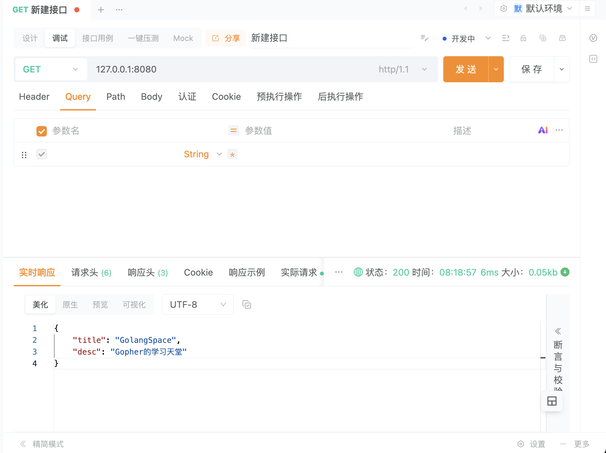
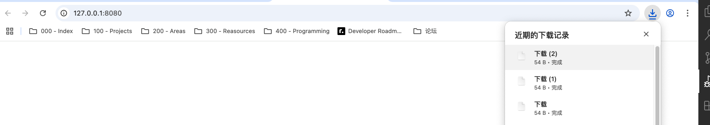
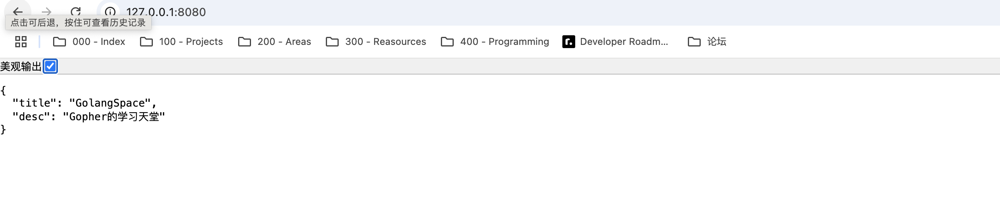

## 问题代码

```go
package main

import (
	"encoding/json"
	"log"
	"net/http"
)

type indexData struct {
	Title string `json:"title"`
	Desc  string `json:"desc"`
}

func index(w http.ResponseWriter, r *http.Request) {
	w.Header().Set("Content-Type", "appplication/json")
	data := indexData{
		Title: "GolangSpace",
		Desc:  "Gopher的学习天堂",
	}
	jsonStr, _ := json.Marshal(data)
	w.Write(jsonStr)
}

func main() {

	server := http.Server{
		Addr: "127.0.0.1:8080",
	}
	http.HandleFunc("/", index)
	if err := server.ListenAndServe(); err != nil {
		log.Println(err)
	}
}

```

## 问题描述

如上代码，`go run main.go` 启动后，在接口调试工具上返回正常，浏览器上运行直接跳转到下载页面，其下载的内容打开后是我想要展示的数据。



---



问题出在 `Content-Type` 头部设置上，代码中有一个拼写错误：

```go
# 错误的
w.Header().Set("Content-Type", "appplication/json")
# 正确的
w.Header().Set("Content-Type", "application/json")
```
在 `appplication`（多了一个 p），正确的应该是 `application/json`。这个拼写错误导致浏览器无法正确识别返回的内容类型，因此它不知道这是一个 JSON 数据，而是将其视为未知的二进制数据，从而触发下载行为而不是直接显示。

修改后，浏览器正确识别返回的 JSON 数据并直接显示了。

